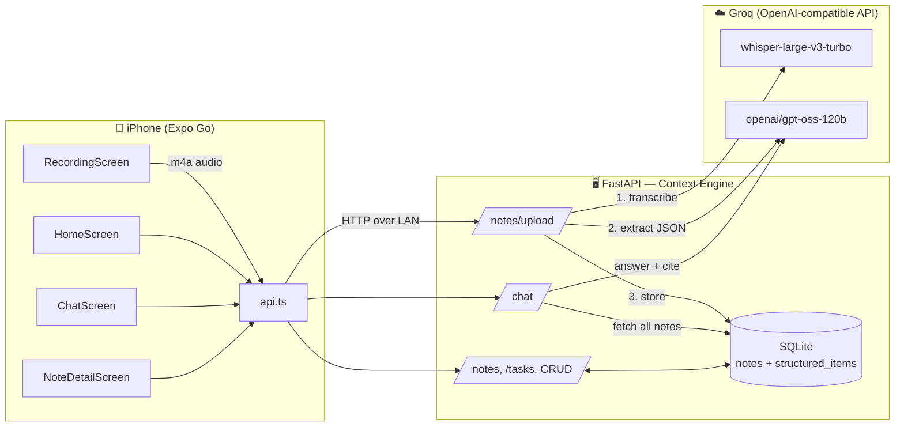
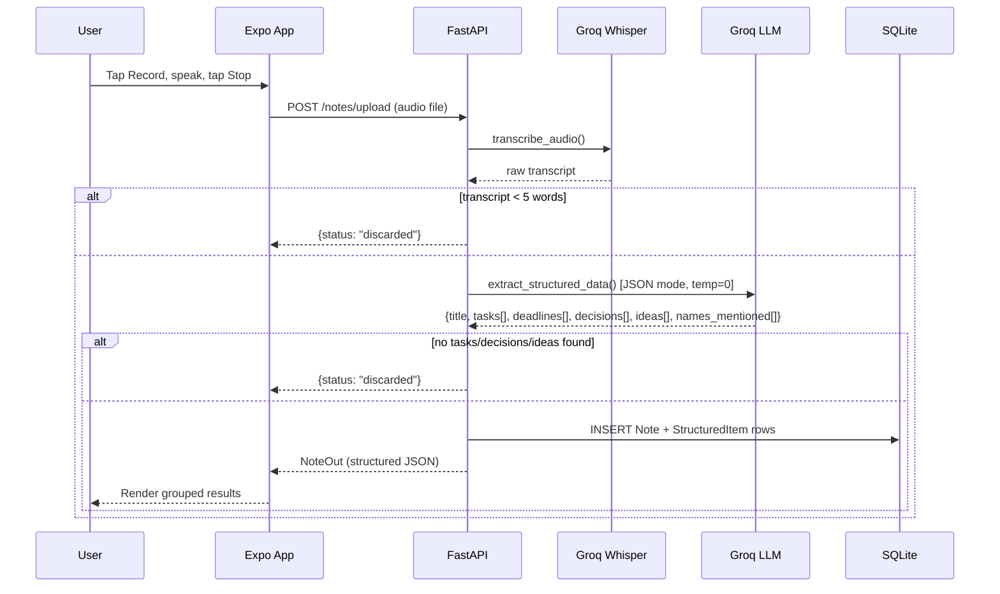
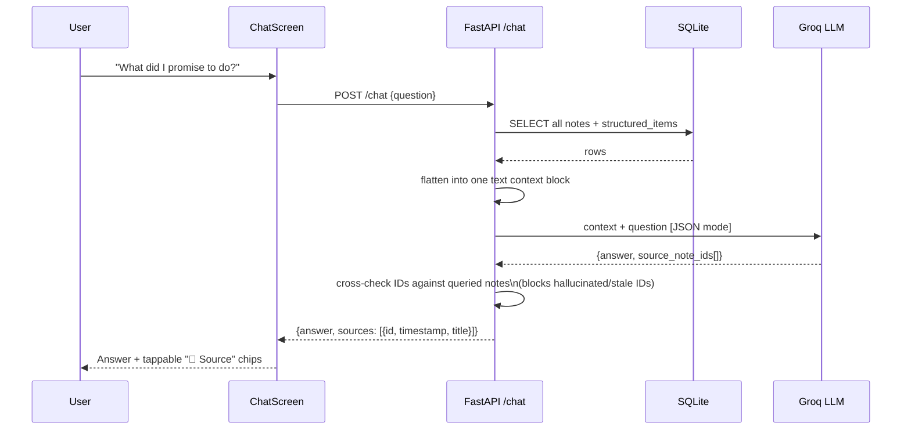
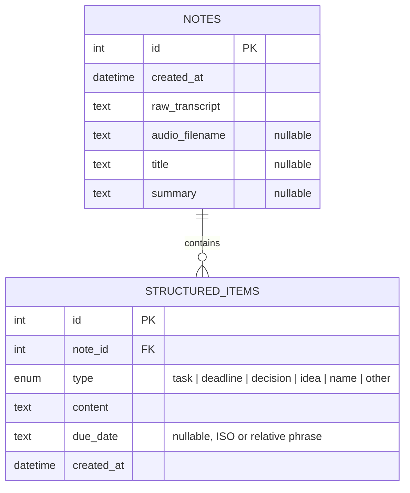

# AI Notetaker

A voice-first notetaker: record a thought out loud, and it's automatically transcribed, distilled into structured tasks / decisions / ideas, stored, and made queryable through a chat interface — with citations back to the source note.

Built as a 24-hour take-home project. Developed on Windows without Xcode access, so the client is React Native (Expo) rather than native Swift, tested live on a physical iPhone via Expo Go.

---

## Table of Contents

- [Overview](#overview)
- [Architecture](#architecture)
- [Tech Stack](#tech-stack)
- [Core Pipeline: Record → Chat](#core-pipeline-record--chat)
- [Data Model](#data-model)
- [API Reference](#api-reference)
- [Project Structure](#project-structure)
- [Getting Started](#getting-started)
- [Product Decisions](#product-decisions)
- [Shortcuts, Assumptions & Limitations](#shortcuts-assumptions--limitations)
- [What's Next](#whats-next)

---

## Overview

| | |
|---|---|
| **Client** | React Native (Expo, TypeScript) — dumb client: records, uploads, renders |
| **Backend** | Python (FastAPI) — the Context Engine; all transcription, extraction, storage, retrieval, and chat logic |
| **Database** | SQLite (`notes` + `structured_items`) |
| **Speech-to-Text** | Groq `whisper-large-v3-turbo` (OpenAI-compatible API) |
| **LLM (extraction, chat, summarize)** | Groq `openai/gpt-oss-120b` |

> **Why Groq instead of OpenAI?** The brief specified Whisper + GPT-4o-mini. To keep the whole project runnable on a free tier (no billing setup required to grade or demo it), all AI calls were routed through Groq's OpenAI-compatible endpoint instead — same SDK, same request shape, different `base_url` and API key. Llama 3 was the original extraction/chat model choice but was deprecated from Groq's catalog mid-build, so the backend was pointed at their current flagship open-weight model (`openai/gpt-oss-120b`) instead. This is a deliberate, documented substitution, not a missed requirement.

---

## Architecture



The client and server are fully decoupled over HTTP on the local network — the mobile app points at the backend's LAN IP (`config.ts`). The backend is the single source of truth; the app holds **no business logic** of its own.

---

## Tech Stack

**Frontend** (`frontend/`)
- Expo SDK 57, React Native 0.86, TypeScript (strict mode)
- `expo-audio` for mic capture, `expo-file-system` for multipart upload, `expo-clipboard`, `@react-native-async-storage/async-storage`
- Screens: `HomeScreen`, `RecordingScreen`, `NoteDetailScreen`, `ChatScreen`, `SettingsScreen`, `TabBar`

**Backend** (`backend/`)
- FastAPI + Uvicorn, SQLAlchemy ORM, Pydantic v2 schemas
- SQLite file database, lightweight startup migrations (`ALTER TABLE` guard for added columns)
- `openai` Python SDK pointed at Groq's `base_url` for transcription, extraction, summarization, and chat

---

## Core Pipeline: Record → Chat

### 1. Capture → Transcribe → Extract → Store



If the LLM's JSON response fails to parse, extraction is retried once before falling back to a raw-transcript-only note rather than crashing the request.

### 2. Chat (Retrieval-Augmented Answering)



Given the 24-hour scope, retrieval is intentionally simple: **no vector database, no chunking, no embeddings** — every note is fetched and flattened into context on each chat call. This is honest about its scaling ceiling (see [What's Next](#whats-next)).

---

## Data Model



Extraction output is walked into typed `StructuredItem` rows and validated through Pydantic response models (`NoteOut`, `StructuredItemOut`) before it ever reaches the client — storage and retrieval are deterministic and type-safe, not regex-parsed free text.

---

## API Reference

| Method | Endpoint | Purpose |
|---|---|---|
| `GET` | `/health` | DB connectivity check |
| `GET` | `/notes` | All notes + structured items, newest first |
| `POST` | `/notes/upload` | Upload audio → transcribe → extract → store |
| `POST` | `/notes/manual` | Same pipeline, from typed text instead of audio |
| `PUT` | `/notes/{id}` | Edit title, summary, or structured items |
| `DELETE` | `/notes/{id}` | Delete one note (+ its audio file) |
| `DELETE` | `/notes` | Delete all notes |
| `POST` | `/notes/{id}/summarize` | Generate a 2-sentence executive summary |
| `POST` | `/notes/{id}/reclassify` | Re-run extraction on the existing transcript |
| `GET` | `/tasks` | All extracted task items across notes |
| `POST` | `/chat` | Ask a question; get an answer + cited source notes |

---

## Project Structure

```
AI-Notetaker/
├── backend/
│   ├── app/
│   │   ├── main.py              # routes
│   │   ├── models.py            # SQLAlchemy: Note, StructuredItem
│   │   ├── schemas.py           # Pydantic request/response models
│   │   ├── database.py          # engine, session, lightweight migrations
│   │   └── services/
│   │       ├── transcription.py # Whisper call
│   │       ├── extraction.py    # structured extraction prompt + call
│   │       ├── summarize.py     # note summarization
│   │       └── chat.py          # RAG-style chat answering
│   ├── requirements.txt
│   └── .env.example             # GROQ_API_KEY=
└── frontend/
    ├── App.tsx                  # tab navigation shell
    ├── HomeScreen.tsx           # note feed
    ├── RecordingScreen.tsx      # record UI, live waveform, timer
    ├── NoteDetailScreen.tsx     # edit note, AI-assist actions
    ├── ChatScreen.tsx           # chat + citation chips
    ├── SettingsScreen.tsx
    ├── api.ts                   # all backend calls
    ├── config.ts                # API_BASE_URL (set to your LAN IP)
    └── types.ts
```

---

## Getting Started

### Backend

```bash
cd backend
python -m venv .venv && source .venv/bin/activate   # or .venv\Scripts\activate on Windows
pip install -r requirements.txt
cp .env.example .env        # then add your GROQ_API_KEY
uvicorn app.main:app --reload
```

Verify: `curl http://localhost:8000/health` → `{"status":"ok"}`

### Frontend

```bash
cd frontend
npm install
```

Edit `config.ts` and replace the placeholder with your machine's LAN IP (find it with `ipconfig` on Windows or `ifconfig` on Mac/Linux — `localhost` will not work from a physical device):

```ts
export const API_BASE_URL = 'http://<YOUR_LAN_IP>:8000';
```

Then:

```bash
npx expo start
```

Scan the QR code with **Expo Go** on your phone. Phone and computer must be on the same Wi-Fi network, and the backend must be running.

---

## Product Decisions

- **Auto-pruning empty notes.** Voice capture inevitably includes mic tests, false starts, and "never mind" moments. A note is discarded server-side if the transcript is under 5 words, or if extraction finds no concrete tasks, decisions, or ideas — so the feed only ever holds something worth returning to.
- **Strict JSON schemas for extraction.** The model is forced into JSON mode against an exact schema, then re-validated through Pydantic on the way out. Failures are explicit (a JSON parse error with a retry-then-fallback path) rather than silently mangled data.
- **Explicit tap-to-record over always-on ambient listening.** Always-on capture raises real privacy concerns, costs battery/data continuously, and needs voice-activity detection that's a project of its own. A deliberate record flow was the right scope for 24 hours, and it made the rest of the pipeline (accurate transcripts, trustworthy extraction, a fast feed) solid rather than spreading effort thin.

---

## Shortcuts, Assumptions & Limitations

- **No authentication** — single implicit user; any client reaching the backend URL sees every note.
- **CORS is wide open** (`allow_origins=["*"]`) — fine for local dev, not production-safe.
- **Model substitution under free-tier constraints** — OpenAI (Whisper-1 / GPT-4o-mini) swapped for Groq (`whisper-large-v3-turbo` / `openai/gpt-oss-120b`); see [Overview](#overview).
- **No formal migration framework** — new columns are added via a startup `ALTER TABLE` guard, workable at this scope but not schema-versioned.
- **No push notifications, background jobs, or offline queueing** — a failed request surfaces a retry option in the UI; it isn't queued.
- **Retrieval is "fetch everything," not real RAG** — see below.

---

## What's Next

- **Real vector retrieval** (Pinecone/Chroma + embeddings) in place of dumping every note into the chat context — the current approach won't scale past a modest note count.
- **True ambient listening** with on-device voice-activity detection, paired with a clear recording indicator to preserve the privacy tradeoff noted above.
- **Real audio-level metering** for the recording waveform (currently a simulated animation, not driven by actual mic input).
- **Alembic migrations** instead of the ad hoc `ALTER TABLE` startup check.
- **Persisted task-done state** and real tags/categories/reminders (currently placeholder UI).
- **An automated test suite** — testing so far has been manual (`curl` against every endpoint; `tsc` / `expo-doctor` / bundle-export checks on the client).
